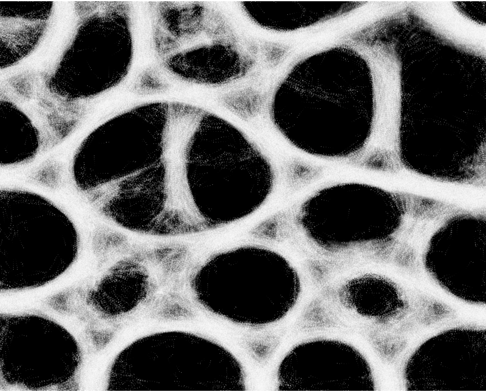

# Physarum in WebGL

[Online version](https://maximilianklein.github.io/physarum/)

This is a re-implementation of https://github.com/SebLague/Slime-Simulation in WebGL and a small learning project for me.
I wanted to have a version that runs in the browser and understand how WebGL works without fancy frameworks that do
most of the work for you.

You can find details regarding physarum at this 2010 paper: https://uwe-repository.worktribe.com/output/980579
Basically you have so called agents that move around and steer towards the most traces of other slime molds.

## Approach

I needed two things for this:

### Movement

I needed to somehow move a and draw huge number of particles according to a *trace map*.
For that I started with this example: https://gpfault.net/posts/webgl2-particles.txt.html
and then I changed it so that it only moves particles and added a sensor function like in
SebLagues implementation. The trace map is simply the rendering of the last map as a texture.

The result of the movement phase is stored in a texture for the next part.

### Diffusion & Decay

This takes the rendered particles and simply applies a diffusion (or a simply blur) and
then makes sure that the traces decay over time.

I started this part with an Game-Of-Life example and adapted it to diffuse and decay. You can find the example here: https://jameshfisher.com/2017/10/22/webgl-game-of-life/
